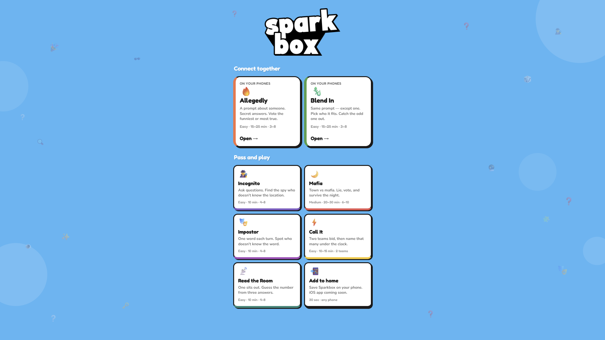

# Sparkbox

Party games for a room full of people. [sparkbox.lol](https://sparkbox.lol)

Allegedly and Blend In run on everyone's phones (one person hosts, everyone else types a code). Incognito, Mafia, Impostor, Call It and Read the Room are pass-and-play on one device.

Vanilla HTML, CSS and JS. No build step. Hosted on Vercel. Online rooms use Supabase.



## Games

**Phones**

- **Allegedly:** a prompt about someone in the room. Secret answers, then vote for the one that lands.
- **Blend In:** same prompt for everyone except one person. Point, discuss, vote who had the odd one.

**One device**

- **Incognito:** find the spy who doesn't know the location
- **Mafia:** town vs mafia
- **Impostor:** one word a turn, spot who doesn't know it
- **Call It:** two teams bid, then name that many things under the clock
- **Read the Room:** one person sits out; guess the number from three answers

## Code

```
index.html          home screen
js/app.js           routing, parked games, shared names
js/games/           one module per game
js/online/          supabase client (publishable key)
js/data/            prompts, words, locations, pfps
css/styles.css
supabase/           tables, rls, realtime
```

Switching games parks the round instead of throwing it away, so you can come back mid-game. Names carry over for the session on the pass-and-play ones.

`points_to_win` on a room is how many rounds you play, not first-to-N.

## Database

SQL is in `supabase/`. `schema.sql` is the base; `add-avatar.sql` and `blendin.sql` are later migrations. RLS is on. Rooms older than 12 hours drop out of the select policy.

## Local

Needs a static server because of ES modules (opening the html file directly won't work):

```
python -m http.server 8080 --bind 127.0.0.1
```

Then [http://127.0.0.1:8080](http://127.0.0.1:8080)
